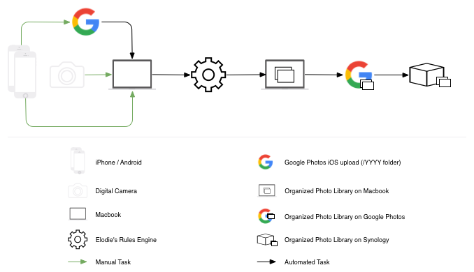

# Hello, I'm Elodie
~~ *Your Personal EXIF-based Photo, Video and Audio Assistant* ~~

[](https://travis-ci.org/jmathai/elodie) [](https://scrutinizer-ci.com/g/jmathai/elodie/?branch=master) [](https://coveralls.io/github/jmathai/elodie?branch=master)

## Quickstart guide

Getting started takes just a few minutes.

### Install ExifTool

Elodie relies on the great [ExifTool library by Phil Harvey](http://www.sno.phy.queensu.ca/~phil/exiftool/). You'll need to install it for your platform.

Some features for video files will only work with newer versions of ExifTool and have been tested on version 10.15 or higher. Check your version by typing `exiftool -ver` and see the [manual installation instructions for ExifTool](http://www.sno.phy.queensu.ca/~phil/exiftool/install.html#Unix) if needed.

```
# OSX (uses homebrew, http://brew.sh/)
brew install exiftool

# Debian / Ubuntu
apt-get install libimage-exiftool-perl

# Fedora / Redhat
dnf install perl-Image-ExifTool

# Windows users can install the binary
# http://www.sno.phy.queensu.ca/~phil/exiftool/install.html
```

### Clone the Elodie repository

You can clone Elodie from GitHub. You'll need `git` installed ([instructions](https://git-scm.com/book/en/v2/Getting-Started-Installing-Git)).

```
git clone https://github.com/jmathai/elodie.git
cd elodie
pip install -r requirements.txt
```

### Give Elodie a test drive

Now that you've got the minimum dependencies installed you can start using Elodie. You'll need a photo, video or audio file and a folder you'd like Elodie to organize them into.

```
# Run these commands from the root of the repository you just cloned.
./elodie.py import --destination="/where/i/want/my/photos/to/go" /where/my/photo/is.jpg
```

You'll notice that the photo was organized into an *Unknown Location* folder. That's because you haven't set up your MapQuest API ([instructions](#using-openstreetmap-data-from-mapquest)).

Now you're ready to learn more about Elodie.

<p align="center"></p>

[Read a 3 part blog post on why I was created](https://medium.com/vantage/understanding-my-need-for-an-automated-photo-workflow-a2ff95b46f8f#.dmwyjlc57) and how [I can be used with Google Photos](https://medium.com/@jmathai/my-automated-photo-workflow-using-google-photos-and-elodie-afb753b8c724).

I work tirelessly to make sure your photos are always sorted and organized so you can focus on more important things. By photos I mean JPEG, DNG, NEF and common video and audio files.

You don't love me yet but you will.

I only do 3 things.
* Firstly I organize your existing collection of photos.
* Second I help make it easy for all the photos you haven't taken yet to flow into the exact location they belong.
* Third but not least I promise to do all this without a yucky propietary database that some friends of mine use.

*NOTE: make sure you've installed everything I need before running the commands below. [Instructions](#quickstart-guide) at the top of this page.*

## Two interfaces, same result

I can be used as a GUI taskbar app or through the command line. My GUI app is great for updating EXIF on existing photos while my command line tools are great for setting up automated jobs.

Read the [instructions on building the GUI taskbar app](tree/master/app) for more information.

## See me in action

Updating EXIF of photos using the GUI taskbar app.

[](http://www.youtube.com/watch?v=fF_jGCaMog0 "Updating Photos Using GUI Taskbar App")

Importing and organizing photos from the command line.

[](http://www.youtube.com/watch?v=oOvKpUO3LLs "Import Photos Using the Command Line")

Updating EXIF of photos from the command line.

[](http://www.youtube.com/watch?v=7kqirQRQ--4 "Updating Photos Using the Command Line")

## The dream setup I am optimized for

I'm most helpful when I'm fully utilized to keep your photos organized.

Here's an example of a very asynchronous setup.
* Specify a folder in your Dropbox/Google Drive to store the organized photo library.
* Set up a Hazel rule to notify me when photos arrive in `~/Downloads` so I can import them.
  * The rule waits 1 minute before processing the photo which gives you a chance to move it elsewhere if it's not something you want in the library.
* Use AirDrop to transfer files from any iPhone to your laptop. That goes to `~/Downloads` for the Hazel rule to process.
  * AirDrop is fast, easy for anyone to use and once the transfer is finished your don't have to stick around. I'll move it to Dropbox/Google Drive and Dropbox/Google Drive will sync it to their servers.
* Periodically recategorize photos by fixing their location or date or by adding them to an album.
* Have a Synology at home set to automatically sync down from Dropbox/Google Drive.

This setup means you can quickly get photos off your or anyone's phone and know that they'll be organized and backed up in 3 locations by the time they're ready to view them.

<p align="center"></p>

## Let's organize your existing photos

My guess is you've got quite a few photos scattered around. The first thing I'll help you do is to get those photos organized. It doesn't matter if you have hundreds, thousands or tens of thousands of photos; the more the merrier.

Fire up your terminal and run this command which *__copies__* your photos into something a bit more structured.

```
./elodie.py import --destination="/where/i/want/my/photos/to/go" /where/my/photos/are
```

I'm pretty fast but depending on how many photos you have you might want to grab a snack. When you run this command I'll `print` out my work as I go along. If you're bored you can open `/where/i/want/my/photos/to/go` in *Finder* and watch as I effortlessly copy your photos there.

You'll notice that your photos are now organized by date and location. Some photos do not have proper dates or location information in them. I do my best and in the worst case scenario I'll use the earlier of the files access or modified time. Ideally your photos have dates and location in the EXIF so my work is more accurate.

Don't fret if your photos don't have much EXIF information. I'll show you how you can fix them up later on but let's walk before we run.

Back to your photos. When I'm done you should see something like this. Notice that I've renamed your files by adding the date and time they were taken. This helps keep them in chronological order when using most viewing applications. You'll thank me later.

```
├── 2015-06-Jun
│   ├── California
│   │   ├── 2015-06-29_16-34-14-img_3900.jpg
│   │   └── 2015-06-29_17-07-06-img_3901.jpg
│   └── Paris
│       └── 2015-06-30_02-40-43-img_3903.jpg
├── 2015-07-Jul
│   ├── Mountain View
│   │   ├── 2015-07-19_17-16-37-img_9426.jpg
│   │   └── 2015-07-24_19-06-33-img_9432.jpg
└── 2015-09-Sep
│   ├── Unknown Location
    │   ├── 2015-09-27_01-41-38-_dsc8705.dng
    │   └── 2015-09-27_01-41-38-_dsc8705.nef
```

Not too bad, eh? Wait a second, what's *Unknown Location*? If I'm not able to figure out where a photo was taken I'll place it into a folder named *Unknown Location*. This typically happens when photos do not have GPS information in their EXIF. You shouldn't see this for photos taken on a smartphone but it's often the case with digital cameras and SLRs. I can help you add GPS information to those photos and get them organized better. Let me show you how.

### Reorganize by changing location and dates

If you notice some photos were incorrectly organized you should definitely let me know. In the example above I put two photos into an *Unknown Location* folder because I didn't find GPS information in their EXIF. To fix this I'll help you add GPS information into the photos' EXIF and then I'll reorganize them.

#### Tell me where your photos were taken
Run the command below if you want to tell me the photos were taken in Las Vegas. You don't have to type all that in though. It's easier to just type `./elodie.py update --location="Las Vegas, NV" ` and select and drag the files from *OS X Finder* into the terminal.

```
./elodie.py update --location="Las Vegas, NV" /where/i/want/my/photos/to/go/2015-09-Sep/Unknown\ Location/2015-09-27_01-41-38-_dsc8705.dng /where/i/want/my/photos/to/go/2015-09-Sep/Unknown\ Location/2015-09-27_01-41-38-_dsc8705.nef
```

You should see this after running that command.

```
└── 2015-09-Sep
│   ├── Las Vegas
    │   ├── 2015-09-27_01-41-38-_dsc8705.dng
    │   └── 2015-09-27_01-41-38-_dsc8705.nef
```

#### Tell me when you took your photos
Run the command below if I got the date wrong when organizing your photos. Similarly to the above command you can drag files from *Finder* into your terminal.

```
./elodie.py update --time="2015-04-15" /where/i/want/my/photos/to/go/2015-09-Sep/Unknown\ Location/2015-09-27_01-41-38-_dsc8705.dng /where/i/want/my/photos/to/go/2015-09-Sep/Unknown\ Location/2015-09-27_01-41-38-_dsc8705.nef
```

That will change the date folder like so.

```
└── 2015-04-Apr
│   ├── Las Vegas
    │   ├── 2015-09-27_01-41-38-_dsc8705.dng
    │   └── 2015-09-27_01-41-38-_dsc8705.nef
```

You can, of course, ask me to change the location and time. I'll happily update the photos and move them around accordingly.

```
./elodie.py update --location="Las Vegas, NV" --time="2015-04-15" /where/i/want/my/photos/to/go/2015-09-Sep/Unknown\ Location/2015-09-27_01-41-38-_dsc8705.dng /where/i/want/my/photos/to/go/2015-09-Sep/Unknown\ Location/2015-09-27_01-41-38-_dsc8705.nef
```

## What about photos I take in the future?

Organizing your existing photos is great. But I'd be lying if I said I was the only one who could help you with that. Unlike other programs I put the same effort into keeping your library organized into the future as I have in getting it organized in the first place.

### Letting me know when you've got more photos to organize

In order to sort new photos that I haven't already organized I need someone to tell me about them. There's no single way to do this. You could use inotify, cron, Automator or my favorite app - Hazel; it doesn't matter.

If you'd like to let me know of a specific photo or group of photos to add to your library you would run one of the following command. Use fully qualified paths for everything since you won't be running this manually.

```
# I can import a single file into your library.
./elodie.py import --destination="/where/i/want/my/photo/to/go" /full/path/to/file.jpg

# I can also import all the photos from a directory into your library.
./elodie.py import --destination="/where/i/want/my/photo/to/go" /where/my/photos/are
```

## Why not use a database?

Look, it's not that I think databases are evil. One of my friends is a database. It's just that I've been doing this for a long time and I've always used a database for it. In the end they're more trouble than they're worth. I should have listened to my mother when she told me to not date a database.

It's a lot more work to organize photos without a database. No wonder everyone else uses them. But your happiness is my happiness. If a little elbow grease on my part makes you happy then I'm glad to do it.

### A bit on how I do all this without a database

Every photo is essentially a database. So it's more accurate to say I use the thousands of tiny databases you already have and use them to organize your photos.

I'm simple. I put a photo into its proper location. I can update a photo to have the right date or location. The latter triggers the first; creating a nice tidy loop of organizational goodness.

I don't do anything else so don't bother asking.

## EXIF and XMP tags

When I organize photos I look at the embedded metadata. Here are the details of how I determine what information to use in order of precedence.

| Dimension | Fields | Notes |
|---|---|---|
| Date Taken (photo) | EXIF:DateTimeOriginal,EXIF:DateTime, EXIF:DateTimeDigitized, file created, file modified |   |
| Date Taken (video, audio) | QuickTime:CreationDate, QuickTime:CreationDate-und-US, QuickTime:MediaCreateDate, file created, file modified |   |
| Location (photo) | EXIF:GPSLatitude/EXIF:GPSLatitudeRef, EXIF:GPSLongitude/EXIF:GPSLongitudeRef  |   |
| Location (video, audio) | XMP:GPSLatitude, Composite:GPSLatitude, XMP:GPSLongitude, Composite:GPSLongitude | Composite tags are read-only |
| Title (photo) | XMP:Title |   |
| Title (video, audio) | XMP:DisplayName |   |
| Album | XMP:Album | User defined tag in `configs/ExifTool_config` |

## Using OpenStreetMap data from MapQuest

I use MapQuest to help me organize your photos by location. You'll need to sign up for a [free developer account](https://developer.mapquest.com/plan_purchase/steps/business_edition/business_edition_free) and get an API key. They give you 15,000 calls per month so I can't do any more than that unless you shell out some big bucks to them. Once I hit my limit the best I'll be able to do is *Unknown Location* until the following month.

Once you sign up you'll have to get an API key and copy it into a file named `~/.elodie/config.ini`. I've included a `config.ini-sample` file which you can copy to `config.ini`.

```
mkdir ~/.elodie
cp config.ini-sample ~/.elodie/config.ini
# now you're ready to add your MapQuest key
```

## Questions, comments or concerns?

The best ways to provide feedback is by reaching out on Twitter at [@getelodie](https://twitter.com/getelodie), opening a [GitHub issue](https://github.com/jmathai/elodie/issues) or emailing me at [jaisen@jmathai.com](mailto:jaisen@jmathai.com).
